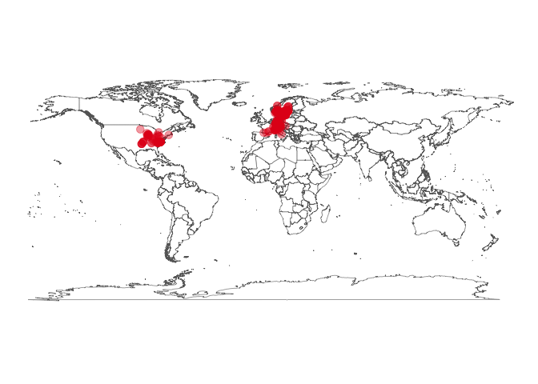

<!-- gbif_intro.html is generated from gbif_intro.Rmd. Please edit that file -->

***

You are here: [R workshop](../) >> [Session 1 Intro](./) >> **Introduction to GBIF data**

***

# GBIF data access with R - Session 1 - Introduction

Scientific reuse of openly published biodiversity information: Programmatic access to and analysis of primary biodiversity information using R. Nordic Oikos 2018, pre-conference R workshop, 18<sup>th</sup> and 19<sup>th</sup> February 2018. Further information [here](http://www.gbif.no/events/2018/Nordic-Oikos-2018-R-workshop.html).

**Session 1** includes brief examples of accessing GBIF data from R using the [rgbif](https://www.gbif.org/tool/81747/rgbif) [package](https://cran.r-project.org/web/packages/rgbif/index.html) from [rOpenSci](https://ropensci.org/). See [session 3](../s3_gbif_demo) for more examples.

***


### Choose a species name

```r
require(rgbif) # r-package for GBIF data
sp_name <- "Hepatica nobilis" # liverleaf (blaaveis:no)
key <- name_backbone(name=sp_name, kingdom="Plantae")$speciesKey
```

### Retrieve GBIF species occurrence data

```r
require(rgbif) # r-package for GBIF data
sp <- occ_search(taxonKey=key, return="data", hasCoordinate=TRUE, limit=200) 
gbifmap(sp)
```


### Retrieve GBIF species occurrence data from Trondheim
Species is *Hepatica nobilis* with taxonKey **5371699**

```r
require('rgbif') # r-package for GBIF data
require('mapr') # rOpenSci r-package for mapping (occurrence data)
bbox <- c(10.2,63.3,10.6,63.5) # Trondheim
sp_bb <- occ_search(taxonKey=key, return="data", hasCoordinate=TRUE, country="NO", geometry=bbox, limit=200) 
map_leaflet(sp_bb, "decimalLongitude", "decimalLatitude", size=3, color="blue")
```


### Extract coordinates suitable for e.g. Maxent

```r
xy <- sp[c("decimalLongitude","decimalLatitude")] ## Extract only the coordinates
sp_xy <- sp[c("species", "decimalLongitude","decimalLatitude")] ## Input format for Maxent
head(sp_xy, n=5) ## preview first 5 records
```

### Write dataframe to file (useful for Maxent etc)

```r
write.table(sp_xy, file="./demo_data/sp_xy.txt", sep="\t", row.names=FALSE, qmethod="double") ## for Maxent
```

### Read data file back into R

```r
sp_xy <- read.delim("./demo_data/sp_xy.txt", header=TRUE, dec=".", stringsAsFactors=FALSE)
```

***

GBIF demo examples for species: *Hepatica nobilis* (taxonKey:5371699).

***

Navigate back to [GitHub project home](https://github.com/GBIF-Europe/nordic_oikos_2018_r) or [GitHub.io html](https://gbif-europe.github.io/nordic_oikos_2018_r/) pages.

***


