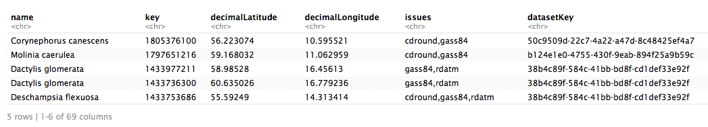
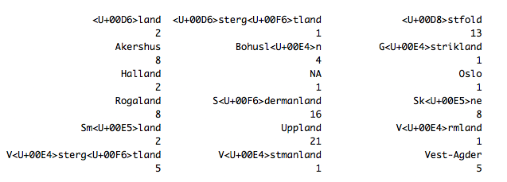
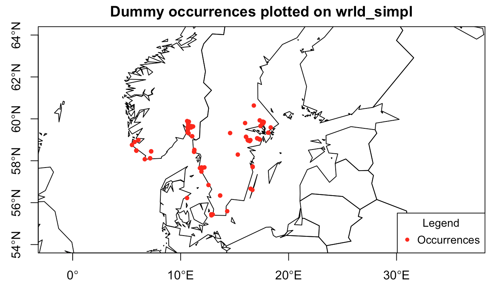
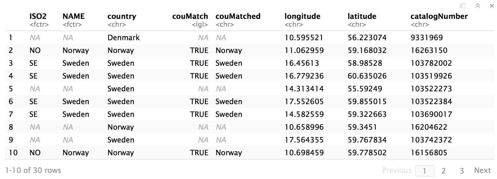
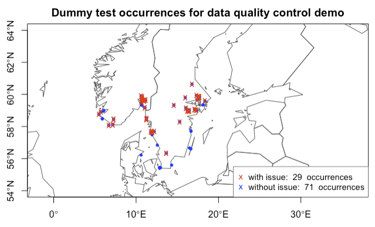
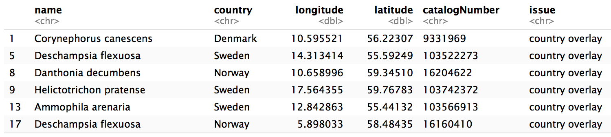
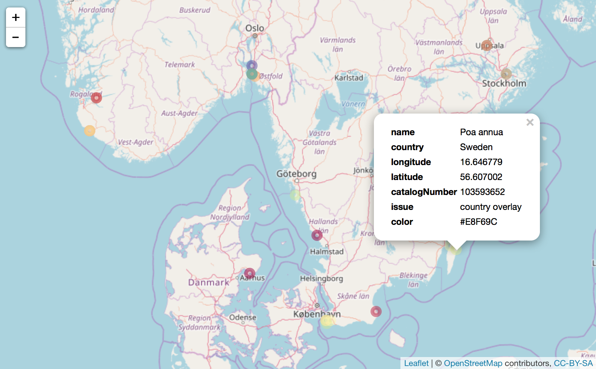

***

You are here: [R workshop](../) >> [Session 3 GBIF data](./) >> **occurrence data quality checks**


***

# Nordic Oikos 2018 - R workshop - Session 3

Scientific reuse of openly published biodiversity information: Programmatic access to and analysis of primary biodiversity information using R. Nordic Oikos 2018, pre-conference R workshop, 18 and 19 February 2018. Further information [here](http://www.gbif.no/events/2018/Nordic-Oikos-2018-R-workshop.html).


[Session 3](./) includes examples of accessing GBIF data from R using the [rgbif](https://www.gbif.org/tool/81747/rgbif) [package](https://cran.r-project.org/web/packages/rgbif/index.html) from [rOpenSci](https://ropensci.org/).

This script (```data_quality```) provides a small set of examples for data quality checks you may want to perform.

***

### Read in some example data
Using [readxl](http://readxl.tidyverse.org/) from tidyverse.

```r
library(tidyverse) ## tidyverse is without external dependencies such as Java or Pearl
library(readxl) ## readxl is part of tidyverse
#excel_sheets("./demo_data/spp_dq.xlsx") ## List sheets
#spp_dq <- read_excel("./demo_data/spp_dq.xlsx", sheet=1, range="A1:BQ101") ## example with range
spp_dq <- read_excel("./demo_data/spp_dq.xlsx", sheet=1) ## manipulated occurrence data, introduced errors
head(spp_dq, n=5)
```


***

### Extract a subset of data-columns

```r
spp_dq_m <- spp_dq[c("name", "decimalLongitude","decimalLatitude", "basisOfRecord", "year", "month", "day", "eventDate", "country", "countryCode", "stateProvince", "county", "municipality", "taxonKey", "species", "scientificName", "catalogNumber", "occurrenceID")] ## Subset columns
xy_dq <- spp_dq[c("decimalLongitude","decimalLatitude")] ## Extract only the coordinates
#head(spp_dq_m, n=5)
```

***

### Make SpatialPointsDataFrame from the example data

```r
options(digits=8) ## set 8 digits (ie. all digits, not decimals) for the type cast as.double to keep decimals
spp_dq_m$lon <- as.double(spp_dq_m$decimalLongitude) ## cast lon from char to double
spp_dq_m$lat <- as.double(spp_dq_m$decimalLatitude) ## cast lat from char to double
#sprintf(spp_dq_m$lat, fmt='%#.6f') ## check: yes, the decimal numbers do have 6 floating point digits
coordinates(spp_dq_m) <- ~lon + lat ## make spp_dq_m into SpatialPointsDataFrame
proj4string(spp_dq_m) <- CRS("+proj=longlat +ellps=WGS84 +datum=WGS84 +no_defs +towgs84=0,0,0") ## set CRS
## If needed, you can use spTransform() to reproject the data to another coordinate reference system (CRS).
## spTransform(spp_dq_m) <- CRS("+proj=longlat +ellps=WGS84 +datum=WGS84 +no_defs +towgs84=0,0,0") ## modify CRS
## We will need the SpatialPointsDataFrame for the sp:over function below
```

***

### Explore the occurrence data

```r
table(spp_dq$name)
table(spp_dq$country)
table(spp_dq$countryCode)
table(spp_dq$county)
#table(toupper(spp_dq$county)) ## Hint: use toupper() or tolower() if you find issues with CasE
```


***

### Vector data with country polygons (maptools:wrld_simpl)
For more detailed borders use a source such as GADM! Here we use wrld_simpl for faster calculations and demonstration purposes.

```r
library(maptools)
library(rgeos)
data(wrld_simpl) ## vector/factor of ISO2, ISO2, NAME, REGION, SUBREGION, LON, LAT, ...
#norway_mask <- subset(wrld_simpl, NAME=="Norway")
plot(wrld_simpl, xlim=c(4, 31), ylim=c(54,64), axes=TRUE) ## xlim=c(minLon,maxLon) ylim=c(minLat,maxLat)
title("Dummy occurrences plotted on wrld_simpl")
points(xy_dq, col='red', pch=20, cex=1) # plot species occurrence points to the map
legend("bottomright", title = "Legend", legend = "Occurrences", pch = 20, col="red", cex = 0.9)
```


***

Note: For using spatial overlay (```raster:over()```) the object need to be ```spatialdataframes``` with the **same CRS**.
```
 crs(wrld_simpl) # result = +proj=longlat +ellps=WGS84 +datum=WGS84 +no_defs +towgs84=0,0,0
 crs(spp_dq_m)   # result = +proj=longlat +ellps=WGS84 +datum=WGS84 +no_defs +towgs84=0,0,0
```
Hint: You can use ```sp:spTransform()``` to modify the CRS, eg:
```
 spTransform(spp_dq_m) <- CRS("+proj=longlat +ellps=WGS84 +datum=WGS84 +no_defs +towgs84=0,0,0")
```

***

### Overlay dummy occurrence data with spatial vector data (country borders)

```r
library(sp)
library(rgeos)
library(dplyr)
spp_dq_over <- over(spp_dq_m, wrld_simpl) ## overlay spp over country polygons
spp_dq_over <- spp_dq_over %>% select(-ISO3, -FIPS, -UN, -LON, -LAT, -AREA, -POP2005, -REGION, -SUBREGION)
spp_dq_over$country <- spp_dq_m$country
spp_dq_over$couMatch <- eval(spp_dq_over$NAME == spp_dq_over$country)
for (i in 1:length(spp_dq_over$country)) {
  spp_dq_over$couMatched[i] <- if (is.na(spp_dq_over$couMatch[i])) NA else spp_dq_over$country[i]
}
spp_dq_over$longitude <- spp_dq_m$decimalLongitude
spp_dq_over$latitude <- spp_dq_m$decimalLatitude
spp_dq_over$catalogNumber <- spp_dq_m$catalogNumber
spp_dq_over$species <- spp_dq_m$species
##
head(spp_dq_over, n=30) ## preview overlay over wrld_simpl, NA = outside land
table(spp_dq_over$couMatched, useNA = "ifany")
##
## Example testing if occurrence coordinates are inside Norway:
#norway_mask <- subset(wrld_simpl, NAME=="Norway")
#spp_dq_over_norway <- over(spp_dq_m, norway_mask) ## overlay spp over country polygons
#head(spp_dq_over_norway) ## preview overlay over wrld_simpl, NA = outside Norway
##
## Example testing if occurrence coordinates are inside Sweden:
#spp_dq_over_sweden <- over(spp_dq_m, subset(wrld_simpl, NAME=="Sweden")) ## overlay
#head(spp_dq_over_sweden) ## preview overlay over wrld_simpl, NA = outside Norway
##
```


```
table(spp_dq_over$couMatched, useNA = "ifany")

Norway Sweden   <NA> 
    23     48     29
```

***

### Plot with different color for occurrences not matching country (-polygon)
```
spp_dq_over: ISO2, NAME, country, couMatch, couMatched, longitude, latitude, catalogNumber
```


```r
i1 <- which(is.na(spp_dq_over$NAME)) ## int [1:29] 1 5 8 9 ... (these did NOT match the overlay, ie. WITH issue)
i2 <- which(toupper(spp_dq_over$NAME) == toupper(spp_dq_over$country)) ## int [1:71] 2 3 4 6 7 10 ... (occ without overlay issue)
plot(wrld_simpl, xlim=c(4, 31), ylim=c(54,64), axes=TRUE, border="#555555") ## xlim=c(minLon,maxLon) ylim=c(minLat,maxLat)
title("Dummy test occurrences for data quality control demo")
points(xy_dq, col='blue', pch=20, cex=0.9) # plot species occurrence (all occurrences)
points(xy_dq[i,], col='red', pch='x', cex=1) ## plot occurrences WITH issue on top (this line is after points for all)
legend("bottomright", title=NULL, legend=c(paste("with issue: ", length(i1), " occurrences"), paste("without issue: ", length(i2), " occurrences")), col=c("red", "blue"), pch=c('x'), cex=0.9, box.col="#777777")
```


***

### Leaflet map (with zoom) for occurrences WITH overlay issue


```r
library('mapr') # rOpenSci r-package for mapping (occurrence data)
library('spocc') # rOpenSci r-package with more biodiversity data sources than GBIF
### TODO spp_dq_issue
head(spp_dq_over[i1,])
#map_leaflet(spp_dq_over[i1,], "longitude", "latitude", size=5)
spp_dq_over_m <- select(spp_dq_over[i1,], name = species, country, longitude, latitude, catalogNumber)
spp_dq_over_m$longitude <- as.numeric(spp_dq_over_m$longitude) ## cast lon to integer (double)
spp_dq_over_m$latitude <- as.numeric(spp_dq_over_m$latitude) ## cast lat to integer (double)
spp_dq_over_m$issue <- "country overlay" ## adding description of issue (for the map pop-up)
head(spp_dq_over_m)
myCol <- colorRampPalette(brewer.pal(11,"Spectral"))(length(unique(spp_dq_over_m$name))) ## create colorRamp
map_leaflet(spp_dq_over_m, "longitude", "latitude", size=5, color=myCol)
```





***
***
***

For this dummy test set I initially selected Poaceae occurrences from Scandinavia...


***

Navigate back to [GitHub project home](https://github.com/GBIF-Europe/nordic_oikos_2018_r) or [GitHub.io html](https://gbif-europe.github.io/nordic_oikos_2018_r/) pages.

***
