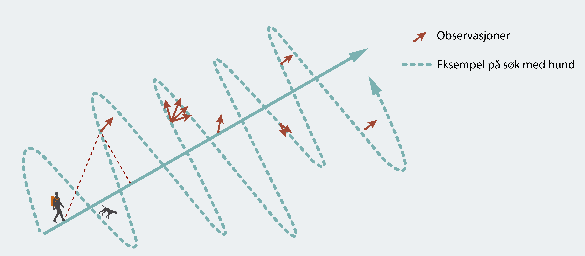
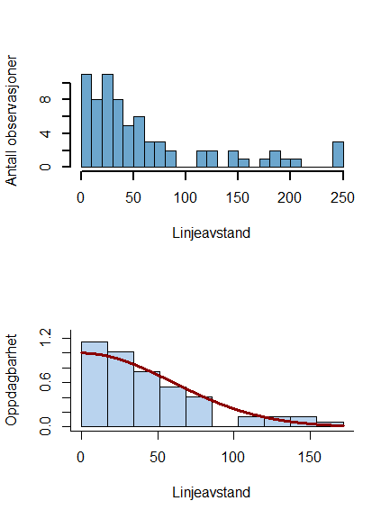

```{r setup, include=FALSE}
knitr::opts_chunk$set(echo = FALSE)
```


## Introduction to the use case
<div class="columns-2">
```{r, out.width = "250px", echo=FALSE}

```

```{r, out.width = "300px", echo=FALSE}
knitr::include_graphics("pictures/HFP_screenshot.png")
```


- The use case covered here is based on a data set recently published on gbif, containing inforamtion from a long-term line transect sampling survey targeting willow ptarmigan (*Lagopus lagopus*)

- The surveys are part of a national program coordinated through the project Hønsefuglportalen [(http://honsefugl.nina.no)](http://honsefugl.nina.no).

- The program is operated in close collaboration between the Norwegian Institute for Nature Research [(NINA; www.nina.no)](www.nina.no), Nord University [(www.nord.no)](www.nord.no), Inland Norway University of Applied Sciences [(www.inn.no)](www.inn.no) as well as landowners responsible for grouse management on their properties (FeFo, Statskog, Fjellstyrene as well as private landowners). The specific part of the project data used here is from surveys carried out in Finnmark county (with FeFo as management authority and data owner). 

</div>


## Accessing the data (1)


```{r, out.width = "300px", echo=FALSE}
knitr::include_graphics("pictures/gbif_screenshot.png")
```


```{r, echo = TRUE, message=FALSE, warning=FALSE, tidy=TRUE, tidy.opts=list(width.cutoff=60)}
library(RJSONIO)
library(dplyr)
library(tidyr)
library(stringr)
library(xml2)

datasetID <- "c47f13c1-7427-45a0-9f12-237aad351040"
dataset <- RJSONIO::fromJSON(paste0("http://api.gbif.org/v1/dataset/",datasetID,"/endpoint"))
endpoint_url <- dataset[[1]]$url 

download.file(endpoint_url, destfile="data/temp.zip", mode="wb")
unzip ("data/temp.zip", exdir = "data")

```


## Accessing the data (2)

```{r, echo = TRUE, tidy=TRUE, tidy.opts=list(width.cutoff=60)}
d <- read.csv("data/event.txt", sep="\t", encoding = "UTF-8") %>% select(-id)  
Occ <- read.csv("data/occurrence.txt", sep="\t", stringsAsFactors = FALSE, encoding = "UTF-8") %>% select(-id)  

```


## Resource citation

Following acceptable reuse of openly published data, we should cite the data and the data set to give credit to the data providers. 

One way to get to the citation string from within R is to follow the procedure bellow: 

```{r, echo = TRUE, message=FALSE, warning=FALSE, tidy=TRUE, tidy.opts=list(width.cutoff=60)}

tmp <- tempfile()
download.file(paste0("http://api.gbif.org/v1/dataset/",datasetID,"/document"),tmp)
meta <- read_xml(tmp) %>% as_list() 
gbif_citation <- meta$additionalMetadata$metadata$gbif$citation[[1]] 
citation <- gsub("GBIF.org", paste(endpoint_url), gbif_citation) 


``` 

- `r paste(citation)`

## Preparation (1)

First - loading some libraries that we will use during the excercise: 

```{r, echo = TRUE, message=FALSE, warning=FALSE, tidy=TRUE, tidy.opts=list(width.cutoff=60)}

library(tidyverse)
library(sp)
library(rgeos)
library(geosphere)
library(rgdal)
library(lme4)
library(AICcmodavg)
library(MuMIn)
library(geosphere)
library(Distance)
library(lubridate)
library(stringr)
library(gridExtra)
library(Distance)
library(knitr)

LongLat = CRS("+proj=longlat +ellps=WGS84 +datum=WGS84")


```


## Preparation (2)

Before entering the data analysis, we also need to do some simple data manipulation: 

```{r, echo=TRUE, message=FALSE, warning =FALSE, tidy=TRUE, tidy.opts=list(width.cutoff=60)}

d <- d %>% mutate(eventYear=year(eventDate)) 

d$dynamicProperties <- gsub("}", '', d$dynamicProperties)
temp2 <- reshape2::colsplit(d$dynamicProperties, ":", c("temp1", "distanceToTransectLine"))
d <- mutate(d, distanceToTransectLine=temp2$distanceToTransectLine)


```


## Inspecting effort data (1)

Summarizing number of years each line is included in the surveys

```{r, echo=TRUE, message=FALSE, warning=FALSE, tidy=TRUE, tidy.opts=list(width.cutoff=60)}

LineData <- filter(d, eventRemarks=="Line transect")
N_years_line <- LineData %>% dplyr::count(locationID)
head(N_years_line)

```


## Inspecting effort data (2)

Summarizing total numerber of transects surveyd each year (object *N_lines_year*), as well as toal transect length each year (object *Effort*) 

```{r, echo=TRUE, message=FALSE, warning =FALSE, tidy=TRUE, tidy.opts=list(width.cutoff=60)}

N_lines_year <- LineData %>% dplyr::count(eventYear)

EffortData <- LineData %>% group_by(eventYear)
Effort <- dplyr::summarize(EffortData, Effort=sum(sampleSizeValue)/1000)

```


## Inspecting effort data (3)


```{r, message=FALSE, warning =FALSE, tidy=TRUE, tidy.opts=list(width.cutoff=60)}

par(mfrow=c(2,1), bty="l", cex=0.9)

par(mar=c(1, 4, 3,1))
barplot(N_lines_year$n, names.arg=N_lines_year$eventYear, col="dark orange", xlab="", ylab="Number of transect lines")
text("A)", cex=1.2, x=2000, y=150)

par(mar=c(4, 4, 1,1))
plot(Effort$eventYear, Effort$Effort, type="b", ylim=c(0, 1000), lwd=2, pch=16, col="dark orange", xlab="Year", ylab="Effort (km)")
text("B)", cex=1.2, x=2000, y=800)

```
  
**Figure 1** *Summary of number of transect lines (A) and total combined length of line transects (B) survey each year in a line transect survey program used to monitor fluctuations in willow ptarmigan (Lagopus lagopus) population in Finnmark county, Norway.* 


## Spatial locations of transect lines (1)

Transforming the footprintWKT-field into a *SpatialLinesDataFrame* object.    

```{r, echo=TRUE, message=FALSE, warning =FALSE, tidy=TRUE, tidy.opts=list(width.cutoff=60)}

lines <- unique(d$locationID)

for (i in 1:length(lines)) {
  if (i == 1) {
    temp <- filter(d, locationID==lines[i] & footprintWKT != "NULL") 
    spTemp <- readWKT(temp$footprintWKT[1], temp$locationID[1], p4s=LongLat)
    
  }
  else {
    temp <- filter(d, locationID==lines[i] & footprintWKT != "NULL") 
    spTemp = rbind(
      spTemp, readWKT(temp$footprintWKT[1], temp$locationID[1], p4s=LongLat)
      
    )
  }
}

data <- as.data.frame(lines)
colnames(data) <- c("locationID")
rownames(data) <- paste(data$locationID)
Lines_transect <- SpatialLinesDataFrame(spTemp, data, match.ID=T)	

```

## Spatial locations of transect lines (2)

Making a map showing the locations of the transect lines

```{r, eval=FALSE, echo=TRUE, message=FALSE, warning =FALSE, evel=FALSE, tidy=TRUE, tidy.opts=list(width.cutoff=60)}

wrld <- map_data("world")
Nor <- subset(wrld, region=="Norway")
Lines_fortify <- fortify(Lines_transect, id="locationID")

x <- c(21.5, 32, 32, 21.5, 21.5)
y <- c(68, 68, 72, 72, 68)
id <- rep(1,5)
box <- data.frame(x,y, id)
fortify_box <- fortify(box, id="id")

p1 <- ggplot() + geom_polygon(data = Nor, aes(x=long, y = lat, group = group), fill="grey70", color="yellow") + 
  geom_path(data=fortify_box, aes(x=x, y=y), lwd=2, col="dark green")+
  coord_map(xlim=c(0, 35), ylim=c(55, 75))
p2 <- ggplot() + geom_polygon(data = Nor, aes(x=long, y = lat, group = group), fill="grey70", color="yellow") + 
  geom_path(data=Lines_fortify, aes(x=long, y=lat, group=group), lwd=3, col="red") +
  coord_map(xlim=c(21.5, 32), ylim=c(68, 71.5))

grid.arrange(p1, p2, ncol=2)

```
  


## Spatial locations of transect lines (3)


```{r, echo=FALSE, message=FALSE, warning =FALSE, evel=TRUE, tidy=TRUE, tidy.opts=list(width.cutoff=60)}

wrld <- map_data("world")
Nor <- subset(wrld, region=="Norway")
Lines_fortify <- fortify(Lines_transect, id="locationID")

x <- c(21.5, 32, 32, 21.5, 21.5)
y <- c(68, 68, 72, 72, 68)
id <- rep(1,5)
box <- data.frame(x,y, id)
fortify_box <- fortify(box, id="id")


p1 <- ggplot() + geom_polygon(data = Nor, aes(x=long, y = lat, group = group), fill="grey70", color="yellow") + 
  geom_path(data=fortify_box, aes(x=x, y=y), lwd=2, col="dark green")+
  coord_map(xlim=c(0, 35), ylim=c(55, 75))

p2 <- ggplot() + geom_polygon(data = Nor, aes(x=long, y = lat, group = group), fill="grey70", color="yellow") + 
  geom_path(data=Lines_fortify, aes(x=long, y=lat, group=group), lwd=3, col="red") +
  coord_map(xlim=c(21.5, 32), ylim=c(68, 71.5))

grid.arrange(p1, p2, ncol=2)


```
  
**Figure 2** *Map illustrating locations of transect lines used in a line transect survey program used to monitor fluctuations in willow ptarmigan (Lagopus lagopus) population in Finnmark county, Norway.*


## Setting up the occurence data 

Combining the event table and the occurence table

```{r, echo=TRUE, message=FALSE, warning =FALSE, tidy=TRUE, tidy.opts=list(width.cutoff=60)}

Occu <- filter(d, dynamicProperties!="NA")
distanceToTransectLine <- numeric()


Occ <- Occ %>% mutate(SexStage=str_c(sex, lifeStage, sep = "")) 

Occ_wide <- spread(Occ[c("eventID", "SexStage", "individualCount", "scientificName")], key="SexStage", value= "individualCount", fill=0)  
Occ_wide <- mutate(Occ_wide, clusterSize=rowSums(Occ_wide[c("FemaleAdult", "MaleAdult", "unknownJuvenile", "unknownunknown")], na.rm=T))
Occ_combined <- plyr::join(Occu, Occ_wide, "eventID")

```


## A simplyfied Distance Sampling example (1)

<div class="centered">

```{r, out.width = "800px", echo=FALSE}

```

</div>

## A simplyfied Distance Sampling example (2)


<div class="centered">

```{r, out.width = "300px", echo=FALSE}

```

</div>


## A simplyfied Distance Sampling example (3)

Example of occurences (orange dots) along four transect lines (red lines) in one of the study areas in the years 2013-2017

```{r, echo=FALSE, message=FALSE, warning =FALSE, tidy=TRUE, tidy.opts=list(width.cutoff=60)}

li <- c("1C64965F-D590-4201-9C4B-79CFE732D30C", "C49B5802-C408-42E7-ABDE-95C146087100", "C9E68D8E-B7BE-49EF-95D7-6D265BCDAA46", "E23DA718-9423-4F25-9274-2E84A3857EB2")


for (i in 1:length(li)) {
  if (i == 1) {
    temp <- filter(d, locationID==paste(li[i]) & footprintWKT != "NULL") 
    spTemp <- readWKT(temp$footprintWKT[1], temp$locationID[1], p4s=LongLat)
    
  }
  else {
    temp <- filter(d, locationID==paste(li[i]) & footprintWKT != "NULL") 
    spTemp = rbind(
      spTemp, readWKT(temp$footprintWKT[1], temp$locationID[1], p4s=LongLat)
      
    )
  }
}


data <- as.data.frame(li)
colnames(data) <- c("locationID")
rownames(data) <- paste(data$locationID)

Lines_transect <- SpatialLinesDataFrame(spTemp, data, match.ID=T)


temp2 <- filter(Occ_combined, locality=="Jarfjord" & eventYear>2012)
coords <- cbind(temp2$decimalLongitude, temp2$decimalLatitude)
points1 <- SpatialPoints(coords, LongLat)

plot(Lines_transect, col="dark red", lwd=4)
points(points1, pch=16, col="dark orange")

```


## A simplyfied Distance Sampling example (4)

Recasting data into the data in the format required by the function *ds* in library *Distance*

```{r, echo=TRUE, message=FALSE, warning =FALSE, tidy=TRUE, tidy.opts=list(width.cutoff=60)}

Occ_combined_Lagopus <- Occ_combined %>% filter(scientificName=="Lagopus lagopus" & distanceToTransectLine !="NA") 

Reg_dat <- data.frame(Region.Label=paste(sort(unique(LineData$eventYear))), Area=rep(1000, length(unique(LineData$eventYear)))) 

Samp_dat <- data.frame(Sample.Label=LineData$eventID, Region.Label=paste(LineData$eventYear), Effort=LineData$sampleSizeValue/1000)

Obs_dat <- data.frame(object=as.numeric(Occ_combined_Lagopus$eventID), 
       Region.Label=paste(Occ_combined_Lagopus$eventYear), Sample.Label=Occ_combined_Lagopus$parentEventID)

Dat_tab <- data.frame(object=as.numeric(Occ_combined_Lagopus$eventID), distance=Occ_combined_Lagopus$distanceToTransectLine/1000, 
                               size=Occ_combined_Lagopus$clusterSize, Strata=paste(Occ_combined_Lagopus$eventYear))

```


## A simplyfied Distance Sampling example (5)

Using Distance Sampling methods to estimate abundance. 

```{r, echo=TRUE, message=FALSE, warning =FALSE, tidy=TRUE, tidy.opts=list(width.cutoff=60)}
ds.model <-ds(data=Dat_tab, region.table=Reg_dat, sample.table=Samp_dat, 
               obs.table=Obs_dat, adjustment="poly", order=2, transect="line", truncation="10%", 
               formula= ~size, key="hn")

```


*We would also like to stress the fact that because there is considerable variation in the study design during the study period from 2000- and onwards. In a proper analysis of the temporal dynamics such variation should be accounted for in the model framework. This is however beyond the scope of this excercise.*

*In our analysis presented here, we will use functions from library [Distance](https://cran.r-project.org/web/packages/Distance/index.html). Note that there are several other r-packages that might provide greater flexibility in the modelling, and that there has been made recent progress in distance sampling models for open populations using Bayesian inference with code written in the BUGS language.*

## A simplyfied Distance Sampling example (6)

Assessing goodness-of-fit....

```{r, echo=TRUE, message=FALSE, warning =FALSE, tidy=TRUE, tidy.opts=list(width.cutoff=60)}

par(mfrow=c(1,2))
plot(ds.model, main="Detection model", pch=16, lwd=2)
fit.test <- ddf.gof(ds.model$ddf, lwd=2, pch=16)

```


## A simplyfied Distance Sampling example (6)


```{r, echo=FALSE, message=FALSE, warning =FALSE, tidy=TRUE, tidy.opts=list(width.cutoff=60)}

x <- ds.model$dht$individuals$D$Label[-length(ds.model$dht$individuals$D$Label)]
y <- ds.model$dht$individuals$D$Estimate[-length(ds.model$dht$individuals$D$Estimate)]

par(bty="l", cex=1.1, lwd=1.2)
plot(as.numeric(as.character(x)), y, type="b", pch=16, col="dark orange", ylim=c(0, 35), xlab="Year", ylab="Ptarmigan density")

```
  
**Figure** *Estimated mean density (ptarmigan pr. km-2) in the years 2000-2017 based on data from a line transect survey program used to monitor fluctuations in willow ptarmigan (Lagopus lagopus) population in Finnmark county, Norway. Data was published using the event-core data model of gbif. Note that the estimates reported here are from a simplified analysis that does not model the variation in spatial arrangement of transect lines across years*    


## Concluding remarks

- As is evident from this example, using the event-core data model makes it possible to publish data that allows for a proper time series analysis of abundance data. 

- The example made here is just one out of many possible ways of analysing these data, but it should be evindent that using the event-core opens up for completely new oportunities.


