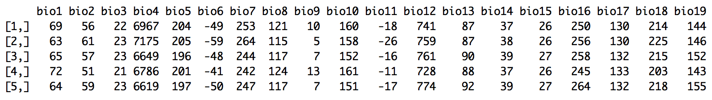
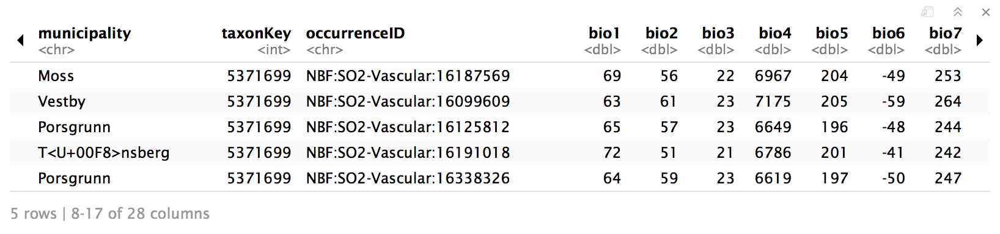

<!-- worldclim.html is generated from worldclim.Rmd. Please edit that file -->

***

You are here: [R workshop](../) >> [Session 5 Environmemt layers](./) >> **worldclim**


***

# Nordic Oikos 2018 - R workshop - Session 5

[Session 5](./) focus on linking GBIF data with environment layers, using the [Raster R-package](https://cran.r-project.org/web/packages/raster/index.html) and other tools.

***

### GBIF data for taxon liverleaf (bl&aring;veis:no)
```{r messages=FALSE, eval=FALSE}
require('rgbif') # r-package for GBIF data
sp_name <- "Hepatica nobilis"; kingdom <- "Plantae" # liverleaf (blaaveis:no), taxonKey=5371699
key <- rgbif::name_backbone(name=sp_name, kingdom=kingdom)$speciesKey
sp <- rgbif::occ_search(taxonKey=key, return="data", hasCoordinate=TRUE, country="NO", limit=100)
sp_m <- sp[c("name", "catalogNumber", "decimalLongitude","decimalLatitude", "basisOfRecord", "year", "municipality", "taxonKey", "occurrenceID")] ## Subset columns
#rgbif::gbifmap(sp, region = "norway")
#mapr::map_leaflet(sp_m, "decimalLongitude", "decimalLatitude", size=2, color="blue")
```

***

### Read example species occurrence data into R
You may of course choose your own species data or other study areas following the examples provided in [session 3](../s3_gbif_demo).
```{r messages=FALSE, eval=FALSE}
sp <- utils::read.delim("./demo_data/sp.txt", header=TRUE, dec=".", stringsAsFactors=FALSE) ## read from file
#head(sp, n=5) ## preview first 5 records
##utils::write.table(sp, file="./demo_data/sp.txt", sep="\t", row.names=FALSE, qmethod="double") ## write
```

### Extract coordinates suitable for e.g. Maxent
```{r eval=FALSE}
library('utils')
xy <- sp[c("decimalLongitude","decimalLatitude")] ## Extract only the coordinates
sp_xy <- sp[c("species", "decimalLongitude","decimalLatitude")] ## Input format for Maxent
#utils::write.table(sp_xy, file="./demo_data/sp_xy.txt", sep="\t", row.names=FALSE, qmethod="double")
#readLines("./demo_data/sp_xy.txt", n=10)
```

***

# Read environment layer from WorldClim into R
[Worldclim](http://worldclim.org/) information about the [bioclim variables](http://worldclim.org/bioclim).

*Citation, Worldclim version 2*: Fick, S.E. and R.J. Hijmans (2017) Worldclim 2: New 1-km spatial resolution climate surfaces for global land areas. *International Journal of Climatology* 37: 4302–4315. [DOI:10.1002/joc.5086](https://doi.org/10.1002/joc.5086).

*Citation, Worldclim version 1*: Hijmans, R.J., S.E. Cameron, J.L. Parra, P.G. Jones and A. Jarvis (2005) Very high resolution interpolated climate surfaces for global land areas. *International Journal of Climatology* 25: 1965-1978. [DOI:10.1002/joc.1276](https://doi.org/10.1002/joc.1276).

### Download and load bioclim layers from WorldClim
Data source worldclim requires variables "var", "res", and if res=0.5 also "lon" and "lat":

 * var = bio, tmin, tmax, tavg, prec, srad, wind, or vapr. [More information](http://worldclim.org/version2).
 * res = "10" minutes (ca 18.5km), "5" min (ca 9.3km), "2.5" min (ca 4.5km), "0.5" 30 arc-seconds (ca 1km)
 * lon = [longitude], lat = [latitude], as integer coordinate-values somewhere inside the tile that you want.

The tiled data comes in 30 x 30 degree tiles. Information about [download by tile](http://www.worldclim.org/tiles.php). More inforamtion about [data formats](http://www.worldclim.org/formats1).

**NB! finer resolution will cause very large Internet download, and cache large files locally!**

```{r eval=FALSE}
require(raster) # spatial raster data management, works well with dismo
env <- getData('worldclim', var='bio', res=10) # 10 degree grid (approx 18.5 km, 342 km2 at equator) 85 MByte
#env <- getData('worldclim', var='bio', res=5) # 5 degree grid (approx 9.3 km, 86 km2) 296 MByte
#env <- getData('worldclim', var='bio', res=2.5) # 2.5 degree grid (approx 4.5 km, 20 km2) 1.3 GByte
#env <- getData('worldclim', var='bio', res=0.5, lon=10, lat=63) # 30 arc-second grid (approx 1 km)
```

***

### Plot environment layers and species occurrences on a map

```{r fig.cap="Figure: GBIF data plotted on environment layer map", eval=FALSE}
plot(env, 1, main=NULL, axes=FALSE) ## could add title here with main="Title"
title(main = bquote(italic(.(sp_name)) ~occurrences~on~Annual~mean~temperature~'(°C*10)'))
points(xy, col='blue', pch=20) # plot species occurrence points to the map
```


***

### Extract climate data for species occurrence points
```{r eval=FALSE}
xy_bio <- extract(env, xy); # extract environment to points (pkg raster)
head(xy_bio, n=5) ## preview first 5 records
write.table(xy_bio, file="./demo_data/xy_bio.txt", sep="\t", row.names=FALSE, col.names=TRUE, qmethod="double")
#xy_bio <- read.delim("./demo_data/xy_bio.txt", header=TRUE, dec=".", stringsAsFactors=FALSE) ## dataframe
```


```{r eval=FALSE}
sp_m_bio <- cbind(sp_m, xy_bio) # generating output file
head(sp_m_bio, n=5) ## preview first 5 records
write.table(sp_m_bio, file="./demo_data/sp_bio.txt", sep="\t", row.names=FALSE, col.names=TRUE, qmethod="double")
#sp_m_bio <- read.delim("./demo_data/sp_bio.txt", header=TRUE, dec=".", stringsAsFactors=FALSE) ## dataframe
```


***

### Size of environment layer can be LARGE if using the finer resolutions

```{r eval=FALSE}
#object.size(env) ## read the space allocated in memory for an environment variable
#format(object.size(env), units = "auto") ## Auto reports multiples of 1024
#format(object.size(env), units = "auto", standard = "SI") ## SI use multiples of 1000
cat("Size of env =", format(object.size(env), units = "auto")) ## Auto reports multiples of 1024
#rm(env) ## save memory - especially useful if using finer resolutions
```

Size of env = 235.5 Kb

***

### The BioClim layers:

 * BIO1 = Annual Mean Temperature (°C * 10) -- (i.e. 231 represents 23.1 °C)
 * BIO2 = Mean Diurnal Range (Mean of monthly (max temp – min temp)) 
 * BIO3 = Isothermality (BIO2/BIO7) (* 100)
 * BIO4 = Temperature Seasonality (standard deviation *100)
 * BIO5 = Max Temperature of Warmest Month (°C * 10)
 * BIO6 = Min Temperature of Coldest Month (°C * 10)
 * BIO7 = Temperature Annual Range (BIO5-BIO6)
 * BIO8 = Mean Temperature of Wettest Quarter (°C * 10)
 * BIO9 = Mean Temperature of Driest Quarter (°C * 10)
 * BIO10 = Mean Temperature of Warmest Quarter (°C * 10)
 * BIO11 = Mean Temperature of Coldest Quarter (°C * 10)
 * BIO12 = Annual Precipitation (mm)
 * BIO13 = Precipitation of Wettest Month (mm)
 * BIO14 = Precipitation of Driest Month (mm)
 * BIO15 = Precipitation Seasonality (Coeficent of Variation) 
 * BIO16 = Precipitation of Wettest Quarter (mm)
 * BIO17 = Precipitation of Driest Quarter (mm)
 * BIO18 = Precipitation of Warmest Quarter (mm)
 * BIO19 = Precipitation of Coldest Quarter (mm)

***

Navigate back to [GitHub project home](https://github.com/GBIF-Europe/nordic_oikos_2018_r) or [GitHub.io html](https://gbif-europe.github.io/nordic_oikos_2018_r/) pages.

***
