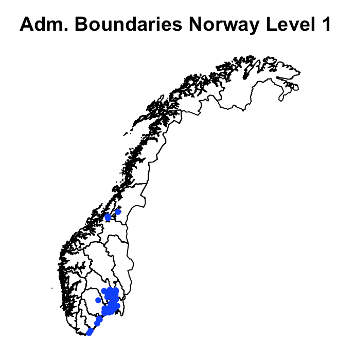
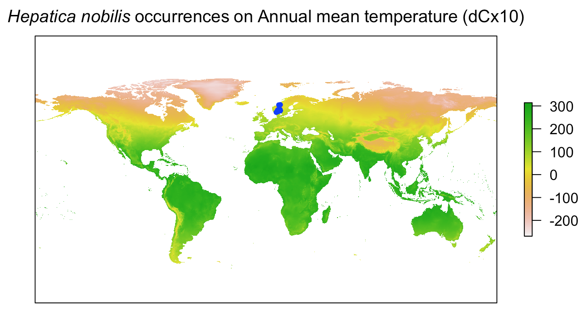
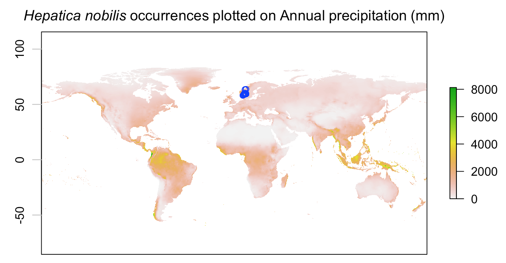

# Nordic Oikos 2018 - R workshop

Scientific reuse of openly published biodiversity information: Programmatic access to and analysis of primary biodiversity information using R. Nordic Oikos 2018, pre-conference R workshop, 18 and 19 February 2018 in Trondheim. Further information [here](http://www.gbif.no/events/2018/Nordic-Oikos-2018-R-workshop.html).

Session 5 focus on linking GBIF data with environment layers, using the [Raster R-package](https://cran.r-project.org/web/packages/raster/index.html) and other tools.

***

```{r include=FALSE, eval=FALSE}
# Setting the working directory, here: to the same directory as the RMD-script
# Notice that eval=FALSE will exclude execution of this chunk in knitr, but enable manual execution in RStudio
#require(rstudioapi)
setwd(dirname(rstudioapi::getActiveDocumentContext()$path))
getwd() ## will display the working directory
```

```{r include=FALSE, eval=FALSE}
# Load R-packages
# Use library(_pk-name_) or require(_pk-name_) to load packages
require(rgbif) # r-package for accessing GBIF
require(maps)
require(mapproj)
require(mapdata)
require(maptools) # mapping tools for spatial objects
require(rgdal) # provides the Geospatial Data Abstraction Library
require(raster) # spatial raster data management, works well with dismo
```


### GBIF data for taxon liverleaf (blaaveis:no) - from Trondheim
```{r messages=FALSE, eval=FALSE}
require(rgbif) # r-package for GBIF data
sp_name <- "Hepatica nobilis"; kingdom <- "Plantae" # liverleaf (blaaveis:no), taxonKey=5371699
key <- name_backbone(name=sp_name, kingdom=kingdom)$speciesKey
#bb <- c(10.2,63.3,10.6,63.5) # Trondheim
#sp_bb <- occ_search(taxonKey=key, return="data", hasCoordinate=TRUE, country="NO", geometry=bb, limit=100)
#sp_bb_m <- sp_bb[c("name", "decimalLongitude","decimalLatitude", "basisOfRecord", "year", "municipality", "taxonKey")] ## Subset columns
sp <- occ_search(taxonKey=key, return="data", hasCoordinate=TRUE, country="NO", limit=100)
sp_m <- sp[c("name", "catalogNumber", "decimalLongitude","decimalLatitude", "basisOfRecord", "year", "municipality", "taxonKey", "occurrenceID")] ## Subset columns
#gbifmap(sp, region = "norway")
#map_leaflet(sp_m, "decimalLongitude", "decimalLatitude", size=2, color="blue")
```


***

## Extract coordinates suitable for e.g. Maxent
```{r eval=FALSE}
xy <- sp[c("decimalLongitude","decimalLatitude")] ## Extract only the coordinates
sp_xy <- sp[c("species", "decimalLongitude","decimalLatitude")] ## Input format for Maxent
# structure(sp_xy) ## preview the list of coordinates
head(sp_xy, n=5) ## preview first 5 records
```

### Write dataframe to file (useful for Maxent etc.)
```{r messages=FALSE, eval=FALSE}
#head(sp, n=5) ## preview first 5 records
write.table(sp_xy, file="./demo_data/sp_xy.txt", sep="\t", row.names=FALSE, qmethod="double") ## for Maxent
#readLines("./demo_data/sp_xy.txt", n=10)
#write.table(sp, file="./demo_data/sp.txt", sep="\t", row.names=FALSE, qmethod="double") ## dataframe
```

### Read data file back into R
```{r messages=FALSE, eval=FALSE}
#rm(sp_xy) ## remove vector sp_xy from the R workspace environment, before re-loading
#sp_xy <- read.delim("./demo_data/sp_xy.txt", header=TRUE, dec=".", stringsAsFactors=FALSE)
#head(sp_xy, n=5) ## preview first 5 records
#sp <- read.delim("./demo_data/sp.txt", header=TRUE, dec=".", stringsAsFactors=FALSE) ## dataframe
```

***

Get administrative borders for Norway
```{r messages=FALSE, eval=FALSE}
library(raster)
gadm_norway <- getData('GADM', country='NOR', level=1, path="./demo_data") ## level 0,1,2,...
plot(gadm_norway, main="Adm. Boundaries Norway Level 1")
points(xy, col='blue', pch=20) ## plot species occurrence points to the map (smaller dots)
```


***

# Read environment layer from WorldClim into R
[Worldclim](http://worldclim.org/) information about the [bioclim variables](http://worldclim.org/bioclim)
Citation: Fick, S.E. and R.J. Hijmans, 2017. Worldclim 2: New 1-km spatial resolution climate surfaces for global land areas. *International Journal of Climatology* 37: 4302–4315. DOI:10.1002/joc.5086

### Download and load bioclim layers from WorldClim
Data source worldclim requires variables "var", "res", and if res=0.5 also "lon" and "lat":

 * var = bio, tmin, tmax, tavg, prec, srad, wind, or vapr. [More information](http://worldclim.org/version2).
 * res = "10" minutes (ca 18.5km), "5" min (ca 9.3km), "2.5" min (ca 4.5km), "0.5" 30 arc-seconds (ca 1km)
 * lon = [longitude], lat = [latitude], as integer coordinate-values somewhere inside the tile that you want

**NB! finer resolution will cause very large Internet download, and cache large files locally!**

```{r eval=FALSE}
require(raster) # spatial raster data management, works well with dismo
env <- getData('worldclim', var='bio', res=10) # 10 degree grid (approx 18.5 km, 342 km2 at equator) 85 MByte
#env <- getData('worldclim', var='bio', res=5) # 5 degree grid (approx 9.3 km, 86 km2) 296 MByte
#env <- getData('worldclim', var='bio', res=2.5) # 2.5 degree grid (approx 4.5 km, 20 km2) 1.3 GByte
#env <- getData('worldclim', var='bio', res=0.5, lon=10, lat=63) # 30 arc-second grid (approx 1 km)
```

### Plot environment layers and species occurrences on a map

```{r fig.cap="Figure: GBIF data plotted on environment layer map", eval=FALSE}
#plot(env, 1, main="Worldclim (BIO 01) Annual mean temperature", axes=FALSE)
plot(env, 1, main=NULL, axes=FALSE)
title(main = bquote(italic(.(sp_name)) ~occurrences~on~Annual~mean~temperature~'(dCx10)'))
#plot(gadm_norway, add=TRUE) ## add admin county borders
points(xy, col='blue', pch=20) # plot species occurrence points to the map (smaller dots)
```


```{r fig.cap="Figure: GBIF data plotted on environment layer map", eval=FALSE}
#plot(env, 1) # plot the first bioclim layer (BIO1 = Annual Mean Temperature)
plot(env, 12, main=NULL, axes=FALSE) # plot bioclim layer, BIO12 = Annual Precipitation
#title(main = "WorldClim, BioClim 12, Annual precipitation")
title(main = bquote(italic(.(sp_name)) ~occurrences~plotted~on~Annual~precipitation~'(mm)'))
axis(side=2, tck = -0.04, col.ticks="gray") ## add axis only left
points(xy, col='blue') # plot species occurrence points to the map
```


```{r messages=FALSE, eval=FALSE}
# Save plot -- IF plotting in the right side plot window, and not inline in the R Markup notebook
#dev.copy(png,'./demo_data/bioclim1_occurrences.png') # save what is in the plot window
#dev.off() # close with dev.off, to write image to file
```


***

## Extract climate data for species occurrence points
```{r eval=FALSE}
xy_bio <- extract(env, xy); # extract environment to points (pkg raster)
head(xy_bio, n=5) ## preview first 5 records
write.table(xy_bio, file="./demo_data/xy_bio.txt", sep="\t", row.names=FALSE, col.names=TRUE, qmethod="double")
#xy_bio <- read.delim("./demo_data/xy_bio.txt", header=TRUE, dec=".", stringsAsFactors=FALSE) ## dataframe
```

```{r eval=FALSE}
sp_m_bio <- cbind(sp_m, xy_bio) # generating output file
head(sp_m_bio, n=5) ## preview first 5 records
write.table(sp_m_bio, file="./demo_data/sp_bio.txt", sep="\t", row.names=FALSE, col.names=TRUE, qmethod="double")
#sp_m_bio <- read.delim("./demo_data/sp_bio.txt", header=TRUE, dec=".", stringsAsFactors=FALSE) ## dataframe
```

***
### Size of environment layer can be LARGE if using the finer resolutions

```{r eval=FALSE}
#object.size(env) ## read the space allocated in memory for an environment variable
#format(object.size(library), units = "auto") ## Auto reports multiples of 1024
#format(object.size(library), units = "auto", standard = "SI") ## SI use multiples of 1000
cat("Size of env =", format(object.size(library), units = "auto")) ## Auto reports multiples of 1024
#rm(env) ## save memory - especially useful if using finer resolutions
```

Size of env = 1.5 Mb

***

```{r include=FALSE, eval=FALSE}
#---------------------------------------------------
#**NOTES -- Read WorldClim environment data into R**
#env <- getData('worldclim', var='bio', res=10) # 10 degree resolution (approx 18 km)
#plot(env, 1, main="BioClim 1 Annual Mean Temperature")
#points(xy, col='red', pch=20) # plot species occurrence points to the map (smaller dots)
#title(sub="GBIF pecies occurrences and BioClim1") # Sub title at bottom
#dev.copy(png,'./demo_data/bioclim1_occurrences.png') # save what is in the plot window
#dev.off() # close with dev.off, to write image to file
#---------------------------------------------------
```

