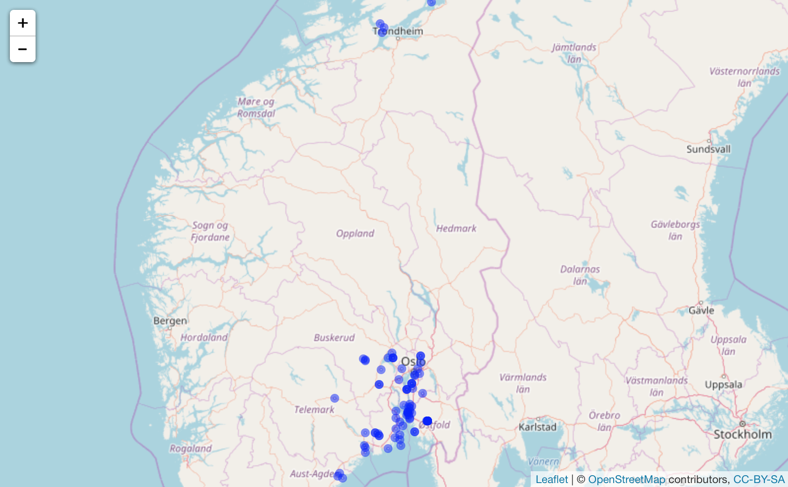
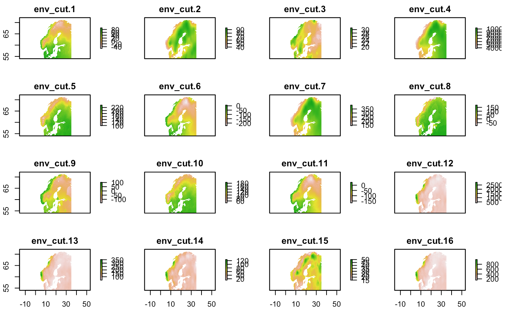
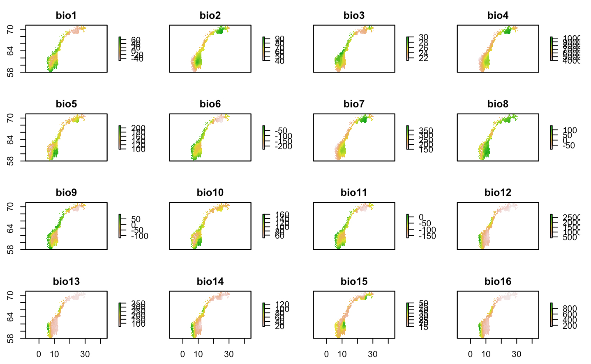

# Nordic Oikos 2018 - R workshop

Scientific reuse of openly published biodiversity information: Programmatic access to and analysis of primary biodiversity information using R. Nordic Oikos 2018, pre-conference R workshop, 18 and 19 February 2018 in Trondheim. Further information [here](http://www.gbif.no/events/2018/Nordic-Oikos-2018-R-workshop.html).

Session 6 focuses on working with environment layers, mapping, cropping and masking layers using the [Raster R-package](https://cran.r-project.org/web/packages/raster/index.html) and other tools.

***


### GBIF data for taxon liverleaf (blaaveis:no) - from Trondheim

```r
library('rgbif') # rOpenSci r-package for GBIF data
library('mapr') # rOpenSci r-package for mapping (occurrence data)
sp_name <- "Hepatica nobilis"; kingdom <- "Plantae" # liverleaf (blaaveis:no), taxonKey=5371699
key <- name_backbone(name=sp_name, kingdom=kingdom)$speciesKey
bb <- c(10.2,63.3,10.6,63.5) # Trondheim
#bb <- c(5.25, 60.3, 5.4, 60.4) # Bergen
#bb <- c(18.7, 69.6, 19.2, 69.8) # Tromsoe
#bb <- c(10.6, 59.9, 10.9, 60.0) # Oslo
sp_bb <- occ_search(taxonKey=key, return="data", hasCoordinate=TRUE, country="NO", geometry=bb, limit=100)
sp_bb_m <- sp_bb[c("name", "catalogNumber", "decimalLongitude","decimalLatitude", "basisOfRecord", "year", "municipality", "taxonKey", "occurrenceID")] ## Subset columns
map_leaflet(sp_bb_m, "decimalLongitude", "decimalLatitude", size=2, color="blue")
```


***

### GBIF data for taxon liverleaf (blaaveis:no) - from Norway

```r
library('rgbif') # rOpenSci r-package for GBIF data
library('mapr') # rOpenSci r-package for mapping (occurrence data)
sp_name <- "Hepatica nobilis"; kingdom <- "Plantae" # liverleaf (blaaveis:no), taxonKey=5371699
key <- name_backbone(name=sp_name, kingdom=kingdom)$speciesKey
sp <- occ_search(taxonKey=key, return="data", hasCoordinate=TRUE, country="NO", limit=100)
sp_m <- sp[c("name", "catalogNumber", "decimalLongitude","decimalLatitude", "basisOfRecord", "year", "municipality", "taxonKey", "occurrenceID")] ## Subset columns (for more useful map pop-up)
#gbifmap(sp, region = "norway")
map_leaflet(sp_m, "decimalLongitude", "decimalLatitude", size=2, color="blue")
```


***

## Extract coordinates suitable for e.g. Maxent

```r
xy <- sp[c("decimalLongitude","decimalLatitude")] ## Extract only the coordinates
sp_xy <- sp[c("species", "decimalLongitude","decimalLatitude")] ## Input format for Maxent
#head(sp_xy, n=5) ## preview first 5 records
```

### Write dataframe to file (useful for Maxent etc.)

```r
write.table(sp_xy, file="./demo_data/sp_xy.txt", sep="\t", row.names=FALSE, qmethod="double") ## for Maxent
#readLines("./demo_data/sp_xy.txt", n=10)
write.table(sp, file="./demo_data/sp.txt", sep="\t", row.names=FALSE, qmethod="double") ## dataframe
#readLines("./demo_data/sp.txt", n=10)
```

### Read data file back into R

```r
sp_xy <- read.delim("./demo_data/sp_xy.txt", header=TRUE, dec=".", stringsAsFactors=FALSE)
sp <- read.delim("./demo_data/sp.txt", header=TRUE, dec=".", stringsAsFactors=FALSE) ## dataframe
```

***

### Get administrative borders for Norway

```r
library(raster)
gadm_norway_1 <- getData('GADM', country='NOR', level=1, path="./demo_data") ## level 0,1,2,...
plot(gadm_norway_1, main="Adm. Boundaries Norway Level 1")
points(xy, col='blue', pch=20) ## plot species occurrence points to the map (smaller dots)
```


***

### Read environment layer from WorldClim into R
For more information about WorldClim see [session 5](../s5_environment).


```r
require(raster) # spatial raster data management, works well with dismo
env <- getData('worldclim', var='bio', res=10) # 10 degree grid (approx 18.5 km, 342 km2 at equator) 85 MByte
```

### Plot environment layers and species occurrences on a map


```r
plot(env, 1, main=NULL, axes=FALSE) ## could add title here with main="Title"
title(main = bquote(italic(.(sp_name)) ~occurrences~on~Annual~mean~temperature~'(dCx10)'))
#plot(gadm_norway, add=TRUE) ## add admin county borders
points(xy, col='blue', pch=20) # plot species occurrence points to the map (smaller dots)
```


```r
plot(env, 12, main=NULL, axes=FALSE) # plot bioclim layer, BIO12 = Annual Precipitation
title(main = bquote(italic(.(sp_name)) ~occurrences~plotted~on~Annual~precipitation~'(mm)'))
axis(side=2, tck = -0.04, col.ticks="gray") ## add axis only left
points(xy, col='blue') # plot species occurrence points to the map
```


```r
# Save plot -- IF plotting in the right side plot window, and not inline in the R Markup notebook
#dev.copy(png,'./demo_data/bioclim1_occurrences.png') # save what is in the plot window
#dev.off() # close with dev.off, to write image to file
```

***


***

# Crop and mask raster layers
Cutting large (global) environment layers to a smaller extent can save significant memory. If your species occurrence data are limited to a region (e.g. Norway, Scandinavia or similar) you might reduce computation time significantly by cropping your environment layers appropriatly.

### Cut environment layer(s) to extent (result is always a square)

```r
library(raster)
library(rgdal)
ext <- extent(3,35,54,72) ## minLon=3, maxLon=35, minLat=54, MaxLat=72 for Scandinavia
env_cut <- crop(env, ext, snap="out") ## square output
#env_cut <- crop(env, ext, snap="out", filename="./demo_data/env_cut.tif") ## add filename to save result
plot(env_cut)
```


### Cut environment layer(s) to a mask (from a shapefile or other vector data)

```r
data(wrld_simpl) ## here you can also read in your OWN vector data (e.g. study area)
norway_mask <- subset(wrld_simpl, NAME=="Norway")
env_crop <- crop(env, extent(norway_mask)) ## crop gives a square (cut to the extent of the mask)
env_mask <- mask(env_crop, norway_mask) ## mask removes data outside the mask
plot(env_mask)
plot(norway_mask, add=TRUE, lwd=2)
```


***

### Plot with extent Scandinavia (using zoom)
Using zoom, the raster data in R workspace environment is still the same size. You only zoom into the region of interest for more useful maps.


***

***

### Size of environment layer can be LARGE if using the finer resolutions


```r
## object.size(env) ## read the space allocated in memory for an environment variable
## format(object.size(env), units = "auto") ## Auto reports multiples of 1024
## format(object.size(env), units = "auto", standard = "SI") ## SI use multiples of 1000
cat("Size of env =", format(object.size(env), units = "auto"))
cat("\nSize of env_cut =", format(object.size(env_cut), units = "auto"))
cat("\nSize of env_mask =", format(object.size(env_mask), units = "auto"))
cat("\nSize of gadm_norway_1 =", format(object.size(gadm_norway_1), units = "auto"))
#rm(env) ## save memory - especially useful if using finer resolutions
```

 * Size of env =            235.5 Kb
 * Size of env_cut =         13.7 Kb
 * Size of env_mask =       940.8 Kb
 * Size of gadm_norway_1 =   12.8 Mb

***

### The BioClim layers:

 * BIO1 = Annual Mean Temperature
 * BIO2 = Mean Diurnal Range (Mean of monthly (max temp – min temp)) 
 * BIO3 = Isothermality (BIO2/BIO7) (* 100)
 * BIO4 = Temperature Seasonality (standard deviation *100)
 * BIO5 = Max Temperature of Warmest Month
 * BIO6 = Min Temperature of Coldest Month
 * BIO7 = Temperature Annual Range (BIO5-BIO6)
 * BIO8 = Mean Temperature of Wettest Quarter
 * BIO9 = Mean Temperature of Driest Quarter
 * BIO10 = Mean Temperature of Warmest Quarter 
 * BIO11 = Mean Temperature of Coldest Quarter 
 * BIO12 = Annual Precipitation
 * BIO13 = Precipitation of Wettest Month
 * BIO14 = Precipitation of Driest Month
 * BIO15 = Precipitation Seasonality (Coe cient of Variation) 
 * BIO16 = Precipitation of Wettest Quarter
 * BIO17 = Precipitation of Driest Quarter
 * BIO18 = Precipitation of Warmest Quarter
 * BIO19 = Precipitation of Coldest Quarter

***

