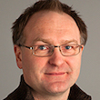
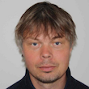
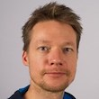
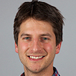

# Nordic Oikos 2018 - R workshop - 18-19 February 2018

***

| **Trainers** |  |
|:--------------:|----------------------------------|
|  | **[Dag Endresen](http://www.nhm.uio.no/english/about/organization/research-collections/people/dtendres/)** <br/> UiO Natural History Museum <br/> University of Oslo (UiO) <br/> [GBIF.no](https://www.gbif.no) |
|  | **[Anders Finstad](https://www.ntnu.edu/employees/anders.finstad)** <br/> NTNU University Museum <br/> [GBIF.no](https://www.gbif.no) |
|  | **[Markus Skyttner](http://www.nrm.se/english/researchandcollections/bioinformaticsandgenetics/staffandcontact/markusskyttner.9003453.html)** <br/> Swedish Museum of Natural History <br/> [GBIF.se](https://www.gbif.se) |
|  | **[Erlend B. Nilsen](https://www.nina.no/Kontakt/Ansatte/Ansattinformasjon.aspx?AnsattID=12833)** <br/> Norwegian Institute for Nature Research (NINA) |
|  | **[Hugo de Boer](http://www.nhm.uio.no/english/about/organization/research-collections/people/hugode/)** <br/> UiO Natural History Museum <br/> University of Oslo (UiO) <br/> [ForBio](http://www.forbio.uio.no/) contact |


```{r echo=FALSE, results='asis', eval=FALSE}
library(knitr)
#kable(trainers)
```

